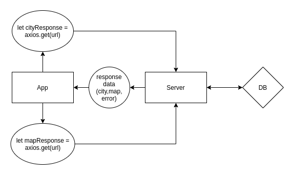

# City Explorer

**Author**: Ben Mils 
**Version**: 1.0.0

## Overview

City Explorer is a simple application that allows the user to retrieve information about a specified city. The application returns the most relevant search result including the City name, latitude, longitude, and a static map image.

## Getting Started

1. Clone down the repo.
2. Enter `cd city-explorer` & `npm install`.
3. Create an `.env` file directly inside of the "city-explorer" directory and add `REACT_APP_LOCATION_KEY=your-api-key-that-begins-pk`.
  - Get an API key from .
  - Set up your access tokens to authorize HTTP referrals: `http://localhost:your-npm-local-port/` or your deployment address.
4. Start the app with `npm start`.

## Architecture

- HTML5, CSS3, JavaScript
- React.js
- [React-Bootstrap library](https://react-bootstrap.github.io/)
- [Axios](https://www.npmjs.com/package/axios)
- [LocationIQ API](https://locationiq.com) 

## Change Log

11-01-2021 10:59PM - Application is fully functional GET with error handling.
11-03-2021 12:15AM - Application has working weather data from local server.
11-03-2021 11:15PM - Application has working live weather and movie data from external APIs via city-explorer-api.
11-04-2021 09:05PM - Refactored to be more modular and restyled page.

## Credit and Collaborations

Collaboration with [Scott Lease](https://github.com/scottie-l) during the planning phase for the initial web request-response cycle.

## Time Estimates

| # | Feature Name                            | Estimated Time |  Start   | Finish  | Actual |
| - | --------------------------------------- | -------------- | -------- | ------- | ------ |
| 1 | Set up your React repository & API keys | 00:30          | 02:50PM  | 03:23PM | 00:33  |
| 2 | Locations                               | 00:45          | 03:50PM  | 07:00PM | 03:10  |
| 3 | Map                                     | 01:30          | 07:15PM  | 08:10PM | 00:50  |
| 4 | Errors                                  | 00:40          | 10:15PM  | 11:05PM | 00:50  |
| 5 | Refactor                                | 01:00          | 08:15PM  | 09:05PM | 00:50  |

